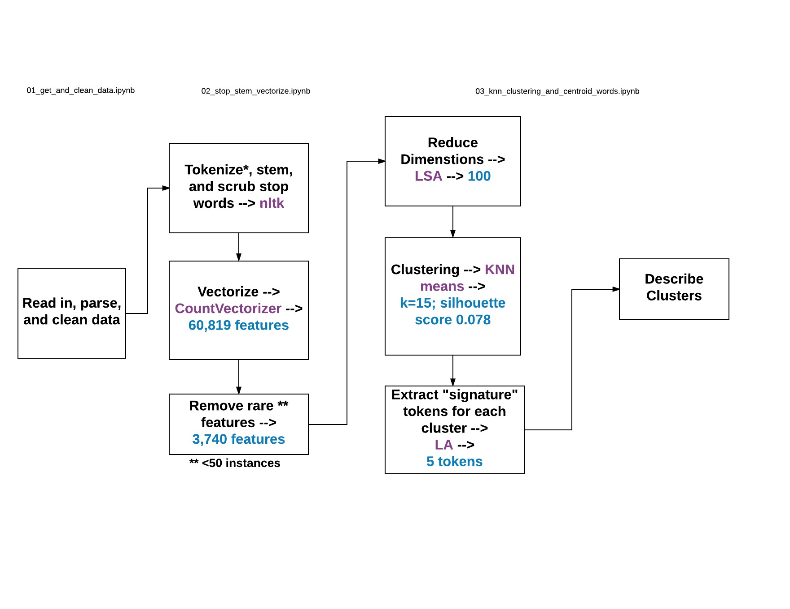

Project title is "Semantics of Kickstarter Projects Descriptions".

Its objective is to conduct NLP analysis of project descriptions on Kickstarter.com to discover an underlying semantic structure

Data file: https://s3.amazonaws.com/weruns/forfun/Kickstarter/Kickstarter_2017-05-15T22_21_11_300Z.json.gz

Below is the flow chart of analysis:

Slides:
- Semantics of Kickstarter Projects Descriptions_ Initial Results.pdf

These are the initial results. Next steps will be:
-- Use all 130K + observations
-- Try clustering scheme with less clusters (since majority of the clusters are not aligned with 15 project categories on Kickstarter)
-- Build supervised classification model to see if new clusters or specific signature tokens can predict success of campaign

